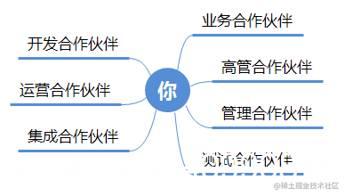

# 合作关系

项目能力——>技术能力——>想象力能力，前者都是后者的基础。

## 第一部分：项目能力

### 第一章 ：合作关系

合作关系是确立了相互信任的一种关系，这是即使面对对手也要一起追求某个目标的意愿。
作为架构师要与以下人建立合作关系

### 合作关系的关键特征

一致、信任、语境、协作和关系

#### 一致

* 确定要和那些人建立合作关系
* 找出在某些领域的思想领袖，多听取他们的意见，便于模型的搭建
* 确定可信的建议者
* 社区评审，运用社区，借助其他人的经验和知识。确定方案的可行性、可靠性

#### 信任

1.“报喜又报忧”是建立信任的一部分
2.对于信息得公开要谨慎，对用户的机密信息要保密
3.在 寻求指导或者批准时要披露以下的信息：

* 解决方案的背景（什么项目、客户、需求、使用信息等）
* 解决方案相关的历史（有谁用过，现在的效果如何）
* 解决方案的已知风险
* 所考虑的被选方案，包括其优缺点
* 成本相关信息（开发、运营、许可证）
* 规模或者易用性信息
* 相关的许可证限制
* 所考虑的方案的优缺点
4.谨慎对用户许诺难以实现的需求
5.作为架构师处理下属的请求要权衡利弊，适当地说不。
6.对于涉及新领域的项目，不要一上来就和客户谈技术，首先要深入了解新产品领域下客户的背景，把自己放在客户的问题领域中。

#### 语境

1.在设计解决方案的时候，你往往不能当个孤胆英雄，要让“关键人物”参与方案的决策。方案既要满足当前的业务需求，也要
为公司下一个项目的重构建立可能性。
2.如何为下级员工介绍目前的状况：

* 从情况开始（每个人都同意、无可争辩的事实）
* 介绍难点（需要解决的问题）
* 展示可能的问题解决方案
* 号召听众行动（他们所能提供的帮助）
* 有礼貌地结束（感谢每个人的帮助和付出）
3.“家丑不可外扬”，保护好支持自己的下属，统一战线，在家庭内部解决分歧。
4.竭尽所能帮助合作伙伴获得成功。

#### 协作

1.寻找导师：在寻找导师的时候要确定自己向从指导关系中学到什么
2.成为导师：计划自己想要实现的目标，要给被指导者停供真实的反馈，并鼓励他们。

#### 关系

1.合作是通过关系确立和维护的。
2.躲避组织中的刻薄鬼
