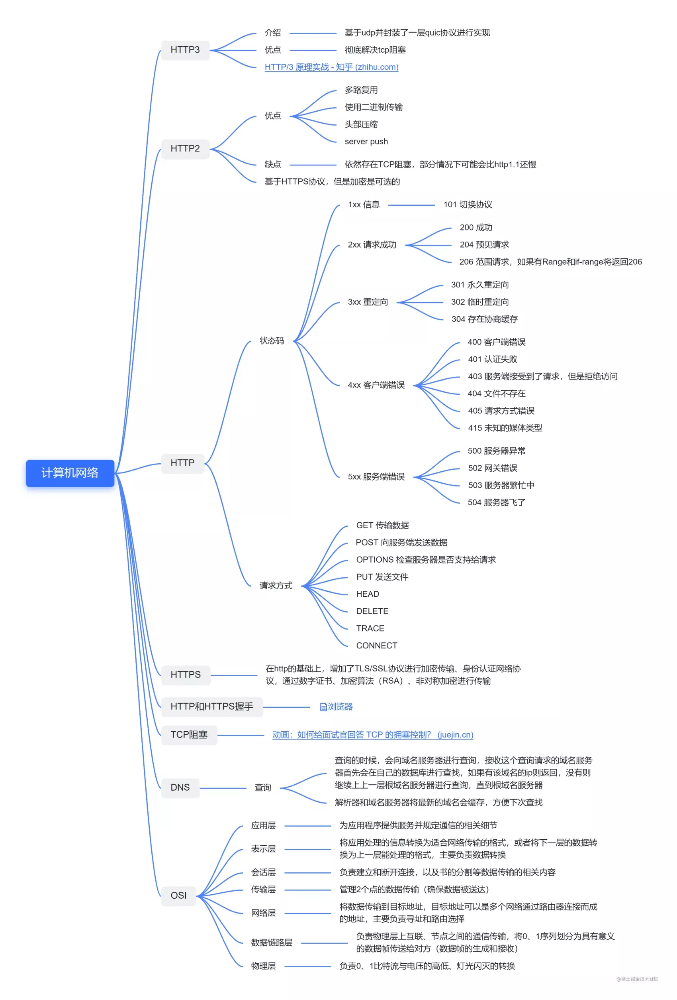

# http 状态码都有哪些

## 状态码第一位数字决定了不同的响应状态，如下

* 1 表示消息
* 2 表示成功
* 3 表示重定向
* 4 表示请求错误
* 5 表示服务器错误

## 1xx

代表请求已被接受，需要继续处理，这类响应是临时响应，只包含状态行和某些可选的响应信息，并一空行结束
常见的有：

* 100 （客户继续发送请求，这是临时响应） 这个临时响应是用来通知客户端它的部分请求已经被服务器接收，且仍未被拒绝。客户端印当据需发送请求的剩余部分，或者如果请求已经完成，忽略这个响应，服务器必须在请求完成后向客户端发送一个最终响应
* 101 服务器根据客户端的请求切换协议，主要用于 websocket 或 HTTP2 升级

## 2xx

代表请求已成功被服务器接收，处理，并接受

* 200 （成功） 请求已成功，请求所希望的响应头或数据体将随此响应返回
* 201 （已创建）请求成功并且服务器创建了新的资源
* 202 （已创建）服务器已经接受请求，但尚未处理
* 203 （非授权信息）服务器已成功处理请求，但返回的信息可能来自另一来源
* 204 （无内容）服务器成功处理请求，但没有返回任何内容
* 205 （重置内容）服务器成功处理请求，但没有返回任何内容
* 206 （部分内容）服务器成功处理了部分请求

## 3xx

表示要完成请求，需要进一步操作，通常这些状态代码用来重定向

* 300 （多种选择）针对请求，服务器可执行多种操作。
* 301 （永久移动）请求的网页已永久移动到新位置。
* 302 （临时移动）服务器目前从不同位置的网页响应请求，但请求者应该继续使用原有位置来进行以后的请求
* 303 （查看其它位置）请求者应当对不同位置使用单独的 GET 请求来检索响应时，服务器返回此代码
* 305 （使用代理）请求者只能使用代理访问请求的网页。
* 307 （临时重定向）服务器目前从不同位置的网页响应请求，但请求者应继续使用原有位置来进行以后的请求

## 4xx

代表了客户端看起来可能发生了错误，妨碍了服务器的处理

* 400 （错误请求）服务器不理解请求的语法
* 401 （未授权）请求要求身份验证。
* 403 （禁止）服务器拒绝请求
* 404 （未找到）服务器找不到请求的网页
* 405 （方法禁用）禁用请求中指定的方法
* 406 （不接受）无法使用请求的内容特性响应请求的网页
* 407 （需要代理授权）此状态代码与 401（未授权）类似，但指定请求者应当授权使用代理
* 408 （请求超时）服务器等候请求时发生超时

## 5xx

表示服务器无法完成明显有效的请求。这类状态代码代表了服务器在处理请求的过程中有错误或异常状态发生

* 500 （服务器内部错误）服务器遇到错误，无法完成请求
* 501 （尚未实施）服务器服务器不具备完成请求的功能
* 502 （错误网关）服务器作为网关或代理，从上游服务器收到无效响应
* 503 （服务不可用）服务器目前无法使用，（由于超载或停机维护）
* 504 （网关超时）服务器作为网关或代理，但是没有及时从上游服务器收到请求
* 505 （ HTTP 版本不受支持）服务器不支持请求中所用的 HTTP 协议版本

