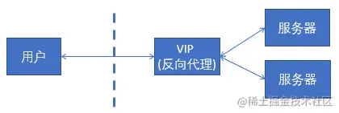

# Nginx

## 正向代理

* 一个位于客户端和原始服务器(origin server)之间的服务器，为了从原始服务器取得内容，客户端向代理发送一个请求并指定目标(原始服务器)，然后代理向原始服务器转交请求并将获得的内容返回给客户端。


* 特点：
  * 代理服务器和客户端处于同一个局域网内；
  * 客户端明确要访问的服务器地址；
  * 屏蔽或者隐藏了真实客户端信息。
* 作用：
  * 访问原来无法访问的资源，如 Google；
  * 可以做缓存，加速访问资源；
  * 对客户端访问授权，上网进行认证；
  d. 代理可以记录用户访问记录（上网行为管理），对外隐藏用户信息。

## 反向代理

* 运行方式是代理服务器接受网络上的连接请求。它将请求转发给内部网络上的服务器，并将从服务器上得到的结果返回给网络上请求连接的客户端，此时代理服务器对外就表现为一个服务器。


* 特点：
  * 代理服务器和源站则处于同一个局域网内；
  * 客户端是无感知代理的存在的，反向代理对外都是透明的；
  * 隐藏了服务器的信息。
* 作用：
  * 保证内网的安全，通常将反向代理作为公网访问地址，Web 服务器是内网;；
  * 负载均衡，通过反向代理服务器来优化网站的负载。

### 负载均衡

* 多在高并发情况下需要使用。其原理就是将数据流量分摊到多个服务器执行，减轻每台服务器的压力，多台服务器（集群）完成工作任务，从而提高了数据的吞吐量。
* 负载均衡策略：轮询（默认）、加权（权重）、ip_hash、url_hash（第三方）、fair（第三方）

### 动静分离

* nginx 提供的动静分离是指把动态请求和静态请求分离开，合适的服务器处理相应的请求，使整个服务器系统的性能、效率更高。
* nginx 可以根据配置对不同的请求做不同转发，这是动态分离的基础。静态请求对应的静态资源可以直接放在nginx 上做缓冲，更好的做法是放在相应的缓冲服务器上。动态请求由相应的后端服务器处理。
* 基本代码示例：

``` nginx
server { 
    ...
    # 所有静态请求都由nginx处理，存放目录为html 
    location ~ \.(gif|jpg|jpeg|png|bmp|swf|css|js)$ { 
        root e:\wwwroot; 
    } 
    # 所有动态请求都转发给 tomcat 处理 
    location ~ \.(jsp|do)$ { 
        proxy_pass http://test; 
    }
}

```
