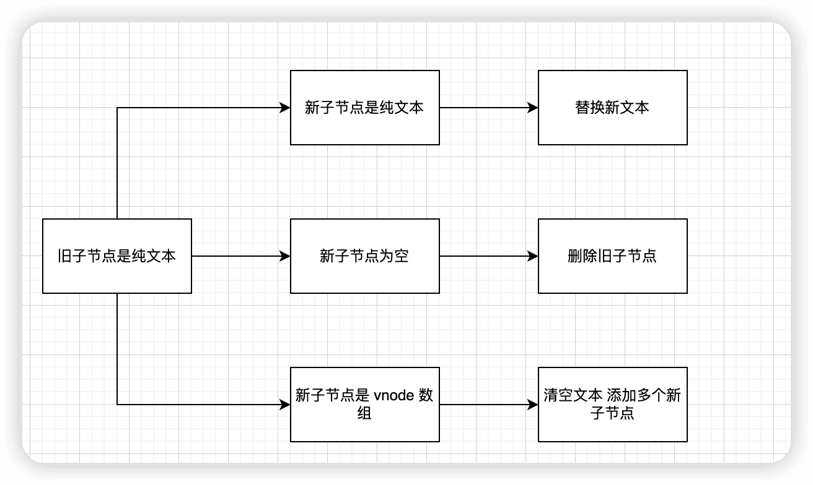
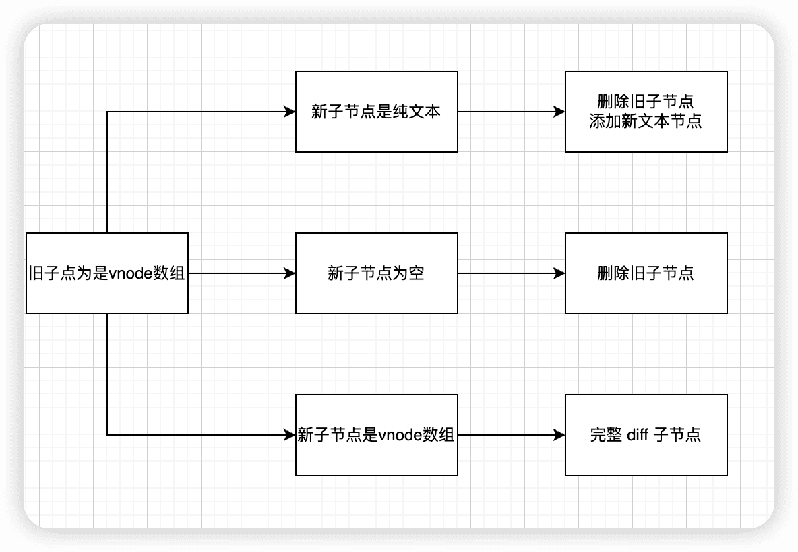
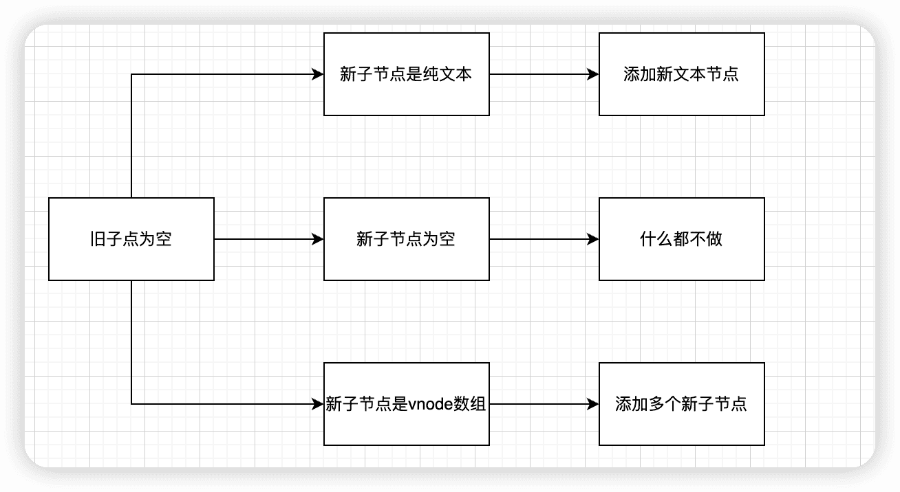
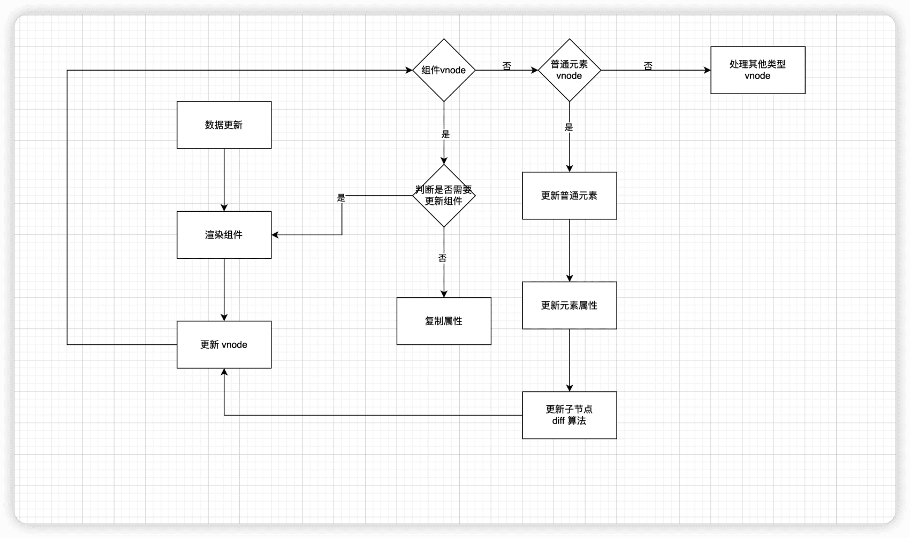

# 组件的渲染流程

## 渲染函数更新组件的过程

### 更新组件主要做了三件事情

1. 更新组件 vnode 节点
2. 渲染新的子树 vnode
3. 根据新旧子树 vnode 执行 patch 逻辑

## patch 流程

首先判断 新旧节点是否相同 vnode 类型 如果不同 则删除旧的节点 再创建新的节点
如果类型相同  则需要进入 diff 更新流程了 然后根据不同的 vnode 类型 执行 不同的逻辑处理

### 首先处理组件

1. 执行 processComponent 中 再执行 updateComponent 函数来更新子组件  
2. updateComponent 函数在更新子组件的时候 会先执行 shouldUpdateComponent 函数 根据新旧子组件 vnode 判断是否需要更新
3. shouldUpdateComponent 内部 主要通过检测并对比组件的 vnode 中的 props children  dirs 和 transition 等属性 来决定是否更新
4. shouldUpdateComponent 返回 true 会先执行 invalidateJob（instance.update)  
5. 再执行 子组件的副作用函数 instance.update 主动触发子组件的更新

### 处理普通元素

1. 执行 processElement 逻辑
2. 更新元素的过程中主要做了两件事  更新 props  以及 更新子节点

### 更新 props

patchProps  函数 会更新 DOM 节点的  class style event 等等其他 dom 属性

### 更新子节点

patchChildren 函数
元素子节点 vnode 一般会有 三种情况 ： 纯文本  vnode  数组 和空
纯文本

vnode数组

空

## diff 算法

### 同步头部节点

需要维护几个变量

1. 头部的索引 i
2. 旧子节点的尾部索引 e1
3. 新子节点的尾部索引 e2
从头部开始 依次对比新旧节点  如果相同 执行 patch 更新节点
不同或者 索引 i 大于 e1 或 e2 则同步过程结束

### 同步尾部节点

依次对比新旧节点 如果相同 执行 patch 更新节点
不同 或者 索引 i 大于 e1 或e2 则同步过程结束

### 处理完 头部尾部节点 只会剩下三种情况

1. 新子节点有剩余 添加新节点
  a. 如果索引 i 大于 尾部索引 e1 并且小于 e2
  b. 直接挂载新子树丛索引 i 开始 到 索引 e2 部分
2. 旧子节点有剩余 删除多余节点
  a. 如果索引 i 大于 尾部索引 e2
  b. 直接删除旧子树从索引 i 开始到索引 e1 部分到节点
3. 未知子序列
  a. diff

## 总结

1. vue 视图更新粒度是组件级别的
2. patch 过程 递归便利子节点的时候 如果遇到组件的 vnode 会进行一些判断 在满足某些条件的时候会触发子组件的更新
3. 对于普通元素的节点 主要是更新一些属性及其子节点
4. 子节点的更新又分为多种情况 其中 最复杂的情况为数组到数组的更新 要在内部根据不同的情况分成几个 diff 流程
  a. 在需要移动的时候还要求解子节点的最长递增子序列
5. 整个更新过程 利用来 树的深度遍历  通过递归执行 patch 函数 完成整个组件树的更新

