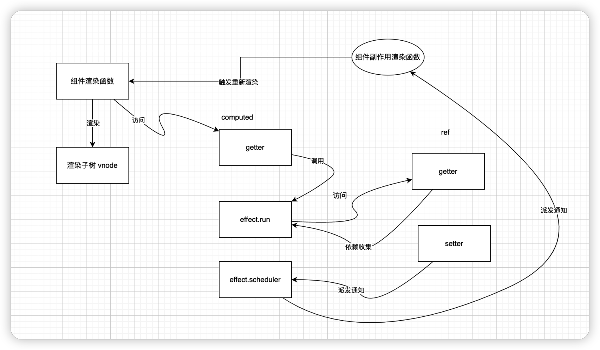

# 计算属性的运行机制

* 计算属性在 template 中也不需要访问 value  因为也拥有了 __v_isRef 属性
* 首先执行 trackRefValue 对计算属性本身进行依赖收集  
  * 这时候 activeEffect 是组件副作用函数对应的 effect 对象
* 会判断 dirty 属性 默认是 true 所以更新的时候会把 _dirtry 设置成 false
  * 接着执行计算属性内部的 effect 对象的 run 函数 进一步执行 computed getter

## 运行机制

## 计算属性的两个特点

### 延时计算

当我们访问计算属性的时候 才会执行  computed getter 函数进行计算

### 缓存

* 内部会缓存上次的计算结果 value  只有 _dirtry 为 true 的时候才会重新计算
* 如果访问计算属性时_dirtry  为 false  直接返回 缓存的 value

## 总结

* 计算属性的本质其实就是响应式对象  通常会依赖单个或者多个响应式对象的值
* 计算属性也支持嵌套 可以由其他计算属性的值计算的来
* 计算属性的核心就是 延时计算和缓存 当依赖发生变化 仅仅标记计算属性内部的 _dirtry  计算属性不会重新计算
  * 当计算属性值被访问的时候 就会判断内部的 _dirtry 值 如果为 false 则直接返回上一次的计算结果
  * 如果为 true 运行内部的 effect.run 函数 重新计算
