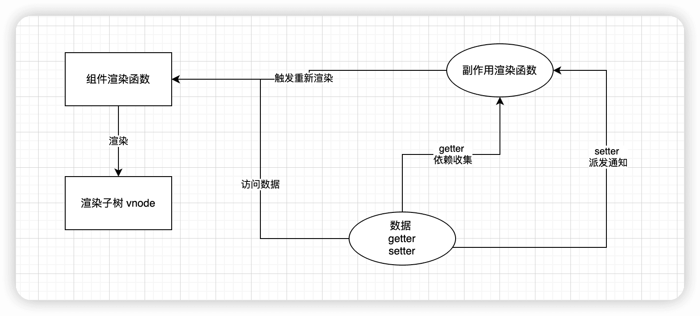
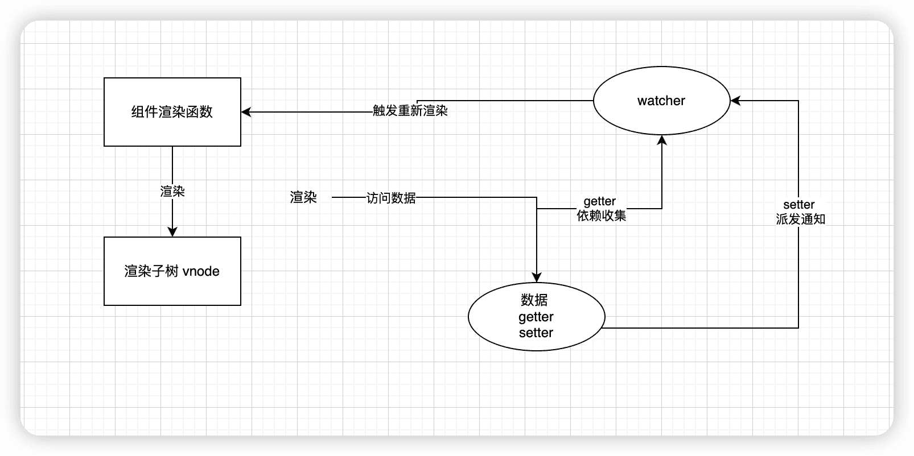

# readonly

* readonly  和 reactive 主要区别 就是执行 createReactiveObject 函数的参数 isReadonly 不同
* 其次在于 baseHandlers 和 collectionHandlers 的区别
* 对于普通对象和数组类型数据的 Proxy 处理器对象  readonly 函数传入的是 baseHandlers 的值是  readonlyHandlers
* 执行 createReactiveObject 的时候 如果 isReadonly是 true 并且传递的参数 target 已经是响应式对象了 仍然可以变只读的对象

## readonlyHandlers

* readonlyHandlers 和 mutableHandlers 区别主要是在于 get set 和 deleteProperty 这三个函数、
* 只读的响应式对象是不允许修改或删除属性的
* 所以在非生产韩剧下 set 和 deleteProperty 函数实现都会发出警告 提示用户对象是只读的

## readonlyGet

* 就是 createGetter(true) 的返回值
* readonly  和 reactive  最大区别就是 readonly 不做依赖收集 因为只读的对象不会被修改 所以不需要追踪变化

## 响应式原理总结

* 利用 Proxy 实现了对数据访问和修改的劫持 弥补了 Object.defineProperty 的不足
* 响应式的核心实现就是通过数据劫持
  * 在访问数据的时候执行依赖收集
  * 在修改数据的时候派发通知
  * 收集的依赖是副作用函数 数据改变后就会触发副作用函数的自动执行
* 把数据变成响应式 是为了数据在变化的时候自动执行一些逻辑
* 组件的渲染中就是让组件访问的数据一旦被修改 就会自动触发组件的重新渲染 实现数据驱动

## vue2 响应式API实现和组件更新之间的关系

## vue3 响应式API实现和组件更新之间的关系

